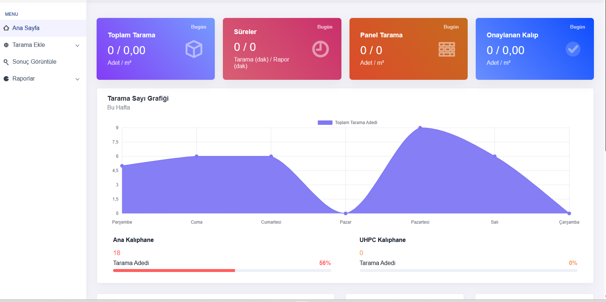
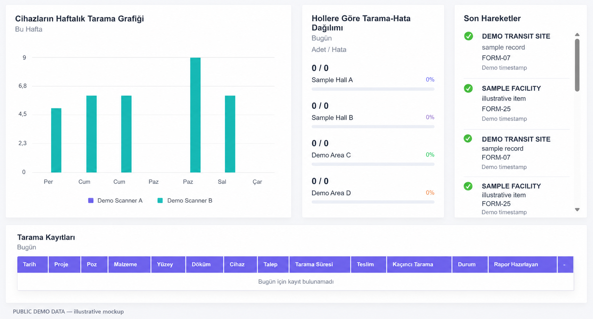
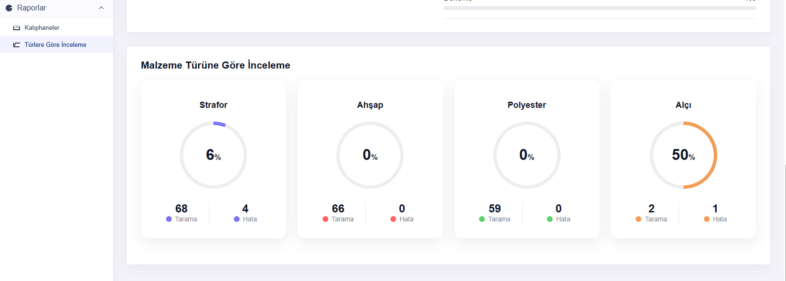
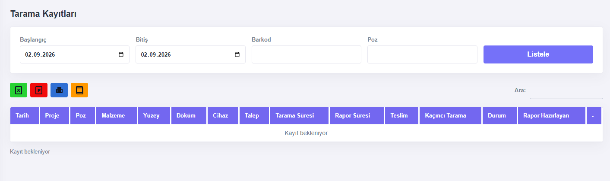
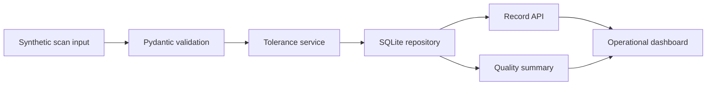

# Industrial Scan Service Demo

> **Status:** This project is currently under active development. Data contracts, report views,
> and interface details may change as the prototype evolves.

A clean-room FastAPI demonstration of an industrial dimensional-scan workflow. It accepts synthetic
scan measurements, evaluates them against a public demo tolerance, stores lightweight records in
SQLite, and produces an operational quality summary.

No employer, customer, project, database, endpoint, image, barcode, operator, or proprietary
process information from a real system is included. The schema and data were created specifically
for this public portfolio repository.

## Tarama prototype reference screens

These static screens show the interface direction that informed this portfolio presentation. They
are not connected to this demo application, a live system, a production database, or an external
endpoint. They must not be interpreted as current scan results, customer records, or operational
reporting data.

<p align="center">
  
  
</p>

<p align="center">
  
  
</p>

The activity screen is a clean public-demo derivative: its project, location, identifier, event,
and time fields are fictitious. The other screens contain no customer or project identifiers.

## Architecture



## Demonstrated concepts

- FastAPI request and response contracts;
- deterministic tolerance classification;
- repository/service separation;
- duplicate-safe public record identifiers;
- lightweight list queries and aggregated reporting;
- synthetic-data dashboard and automated tests.

## Run

```bash
python -m pip install -e ".[dev]"
uvicorn app.main:app --reload
pytest
ruff check .
```

Open `http://127.0.0.1:8000` or inspect `/docs`.
